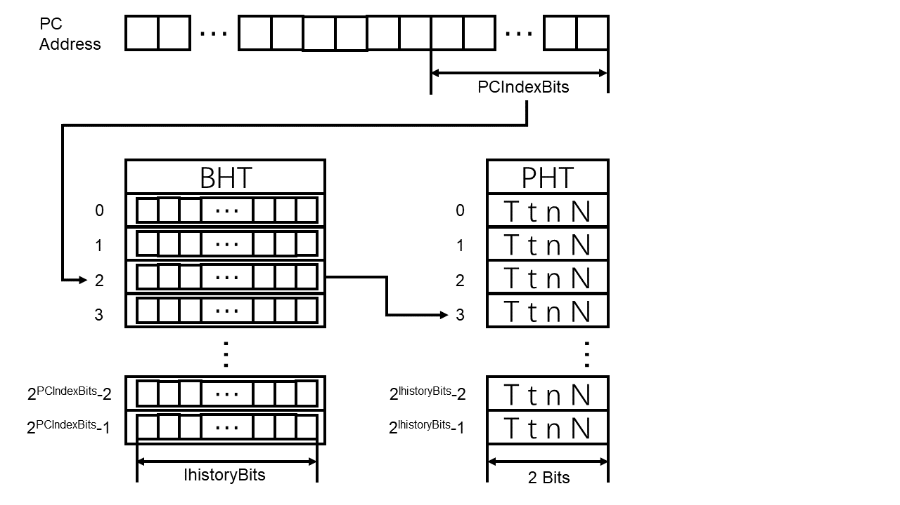
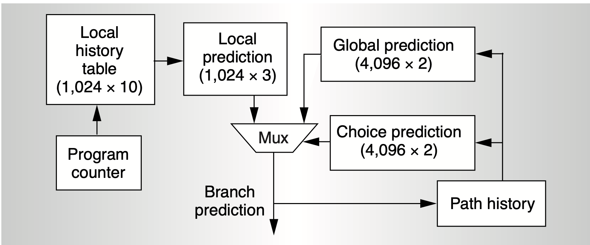
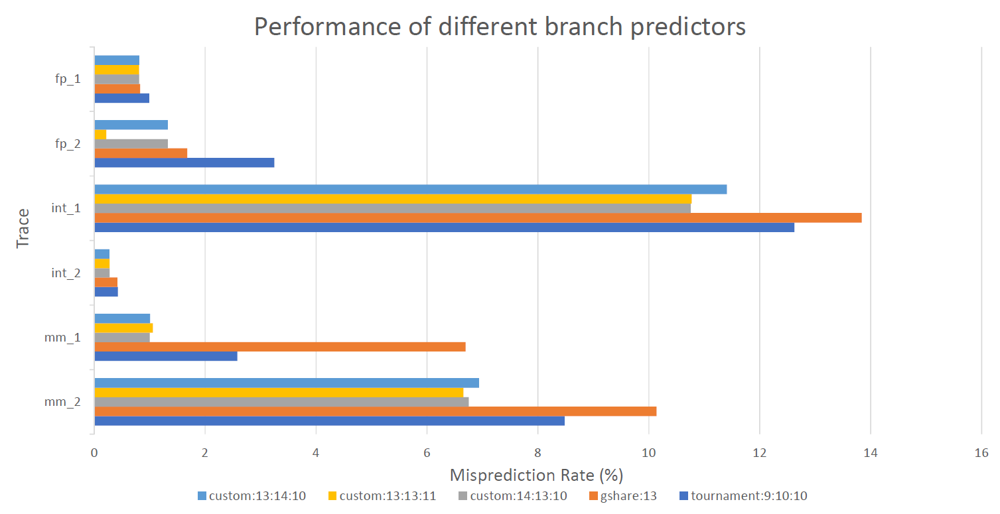

# Branch Predictor Report

Team members: Zeyuan Zhang (A59016242), Xiang Yu (A59016312)

## Introduction

### G-share Predictor

The gshare predictor uses a pattern history table (PHT) addressed by the XOR of PC address and global branch history shift register (with size of ghistoryBits). Each pattern history table entry takes 2 bit. The amount of memory used by the PHT is 2bit * 2^ghistoryBits, which reaches 16 Kb when ghistoryBits is 13. By using the XOR of address and branch history, G-share predictor avoids collisions between address that has the same upper bits, therefore making better use of the whole PHT (compared to gselect). On the other hand, as a "global"-based predictor, it would be harder for G-share to capture local patterns, especially in nested loops. 

### PA Predictor

The PA predictor uses a branch history shift register table(BHT) and a pattern history table (PHT). It uses the last PCIndexBits bits of PC address to index the BHT, and uses the branch history(lhistoryBits) recorded in the BHT entry to index a PHT entry, finally uses the PHT entry(2 bits) to predict.
The amount of memory used by the BHT is $lhistoryBits * 2^{PCIndexBits}$.
The amount of memory used by the PHT is $2 * 2^{lhistoryBits}$.
The total memory usage is $lhistoryBits * 2^{PCIndexBits} + 2 * 2^{lhistoryBits}$.
The data structure is shown below.

### Tournament Predictor

The tournament predictor used in the alpha 21264 microprocessor[1] composes of a Per-address Two-Level Branch Predictor\[2\](PA predictor) and a global predictor (See the graph below, the sizes of components vary in our implementation). The global predictor simply uses global history to address the prediction from the global history table (GHT).

The amount of memory used in the PA predictor is $m1 = lhistoryBits*2^{pcIndexBits} + 2*2^{lhistoryBits}$ bit. 
The amount of memory used in the global predictor is $m2 = 2 * 2^{ghistoryBits}$ bit. 
The amount of memoryused for choosing between the two predictors is $m3 = 2 * 2^{ghistoryBits}$ bit. 

As per the requirements, ghistoryBits=9, lhistoryBits = 10, pcIndexBits=10. Therefore the total amount of memory used is 10+2 + 1 + 1 = 14 Kb.

### Ideas

In experiments, we found that the global predictor performs worse than the local predictor in 9:10:10 settings. It motivate us to replace the global predictor with G-share predictor.

### Custom Predictor

We implemented our custom branch predictor combining the PA predictor and gshare predictor. The choice between the two branch predictors is done with the last pcIndexBits of PC.

The amount of memory used in the PA predictor is $m1 = lhistoryBits*2^{pcIndexBits} + 2*2^{lhistoryBits}$ bit. 
The amount of memory used in the G-share predictor is $m2 = 2 * 2^{ghistoryBits}$ bit. 
The amount of memory used for choosing between the two predictors is $m3 = 2 * 2^{pcIndexBits}$ bit. 

The total amount of cache used in our custom predictor is $m =  m1+m2+m3 $.

We have three configurations in our experiments:

- custom:13:13:11 (The default): ghistoryBits=13, lhistoryBits=13, pcIndexBits=11, the total amount of memory used is m= 62 Kb. 
- custom:14:13:10: ghistoryBits=13, lhistoryBits=14, pcIndexBits=10,  the total amount of memory used is m= 64 Kb. 
- custom:13:14:10: ghistoryBits=14, lhistoryBits=13, pcIndexBits=10, the total amount of memory used is m = 63 Kb.

## Result

We ran experiments on given traces and compare our custom predictors to the two baselines (gshare:13 and tournament:9:10:10). The result is recorded in "result.xlsx" and we plot the result below in misprediction rate(%).

We can see that our custom predictors outperform baselines in all tests. It's interesting that the 13:13:11 settings leads to massive improvments in fp_2 test, while maintaining a competitive accuracy in other tests. So we chose it as the default paramter for our custom predictor.

| trace | custom:13:14:10 | custom:13:13:11  | custom:14:13:10 | gshare:13 | tournament:9:10:10 |
|  ----  | ----  | ----  | ----  | ----  | ----  |
| fp_1  | 0.815 | 0.814 | 0.815 | 0.842 | 1.145 |
| fp_2  | 1.146 | 0.222 | 1.146 | 1.5 | 7.577 |
| int_1  | 11.447 | 10.803 |10.808 | 13.9 | 17.57 |
| int_2  | 0.28 | 0.284 | 0.282 | 0.426 | 0.78 | 
| mm_1  | 0.972 | 1.009 | 0.948 | 6.5 | 10.275 |
| mm_2  | 6.989 | 6.692 | 6.812 | 10.229 | 12.75 |

## Citations

[1] Kessler, Richard E. "The alpha 21264 microprocessor." *IEEE micro* 19.2 (1999): 24-36.

[2] Yeh and Patt, “Two-Level Adaptive Training Branch Prediction,” MICRO 1991.

