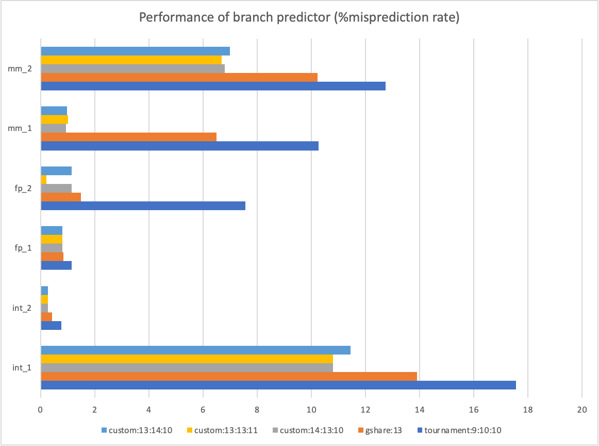

# Branch Predictor Report

Team members: Zeyuan Zhang (A59016242), Xiang Yu

## Introduction

### G-share Predictor

The gshare predictor uses a branch history table (BHT) addressed by the XOR of address and branch history (with ghistoryBits). The amount of memory used by the BHT is 2bit * 2^ghistoryBits, which reaches 16 Kb when ghistoryBits is 13. By using the XOR of address and branch history, gshare predictor avoids some collision between address that has the same upper bits, therefore making better use of the whole BHT (compared to gselect). On the other hand, as a "global"-based predictor, it would be harder for gshare to capture local patterns, especially in nested loops. 

### Tournament

The tournament predictor used in the alpha 21264 microprocessor[1] composes of a Per-address Two-Level Branch Predictor\[2\](PA predictor) and a global predictor (See the graph below, the sizes of components vary in our implementation). The global predictor simply uses global history to address the prediction from the global history table (GHT).

The PA predictor is implemented with a set of Local history table (LHT) addressed by "pcIndexBits" (which stores $2^{pcIndexBits}$ entries of branch histories, each sized lhistoryBits) and a pattern history table (PHT) addressed by history patterns ($2^{lhistoryBits}$ entries).
The amount of memory used in the PA predictor is $m1 = lhistoryBits*2^{pcIndexBits} + 2*2^{lhistoryBits}$ bit. 
The amount of memory used in the global predictor is $m2 = 2 * 2^{ghistoryBits}$ bit. 
The amount of memoryused for choosing between the two predictors is $m3 = 2 * 2^{ghistoryBits}$ bit. 

As per the requirements, ghistoryBits=9, lhistoryBits = 10, pcIndexBits=10. Therefore the total amount of memory used is 10+2 + 1 + 1 = 14 Kb.

### 

In experiments, we found that the global predictor performs worse than the local predictor in 9:10:10 settings. It motivate us to replace the global predictor with gshare predictor.

### Custom Predictor

We implemented our custom branch predictor combining the PA predictor and gshare predictor. The choice between the two branch predictors is done with the last pcIndexBits of PC.

The amount of memory used in the PA predictor is $m1 = lhistoryBits*2^{pcIndexBits} + 2*2^{lhistoryBits}$ bit. 
The amount of memory used in the gshare predictor is $m2 = 2 * 2^{ghistoryBits}$ bit. 
The amount of memoryused for choosing between the two predictors is $m3 = 2 * 2^{pcIndexBits}$ bit. 

The total amount of cache used in our custom predictor is $m =  m1+m2+m3 $.

We have three configurations in our experiments:

- custom:13:13:11 (The default): ghistoryBits=13, lhistoryBits=13, pcIndexBits=11, the total amount of memory used is m= 62 Kb. 
- custom:14:13:10: ghistoryBits=13, lhistoryBits=14, pcIndexBits=10,  the total amount of memory used is m= 64 Kb. 
- custom:13:14:10: ghistoryBits=14, lhistoryBits=13, pcIndexBits=10, the total amount of memory used is m = 63 Kb.

## Result

We ran experiments on given traces and compare our custom predictors to the two baselines (gshare:13 and tournament:9:10:10). The result is recorded in "result.xlsx" and we plot the result below in misprediction rate(%).

We can see that our custom predictors outperform baselines in all tests. It's interesting that the 13:13:11 settings leads to massive improvments in fp_2 test, while maintaing a competitive accuracy in other tests. So we chose it as the default paramter for our custom predictor.

## Citations

[1] Kessler, Richard E. "The alpha 21264 microprocessor." *IEEE micro* 19.2 (1999): 24-36.

[2] Yeh and Patt, “Two-Level Adaptive Training Branch Prediction,” MICRO 1991.

